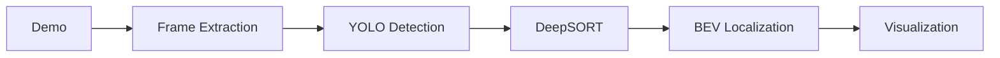

# Monocular BEV Localization

---

## Abstract

Text goes here.

---

## Motivation

## Project objectives / Key features

## Pipeline Overview

<figure markdown>
  { width="800" }
  <figcaption>End-to-end pipeline: detection → tracking → BEV projection</figcaption>
</figure>

## Project Structure

## Sample Output

## Acknowledgements / Credits