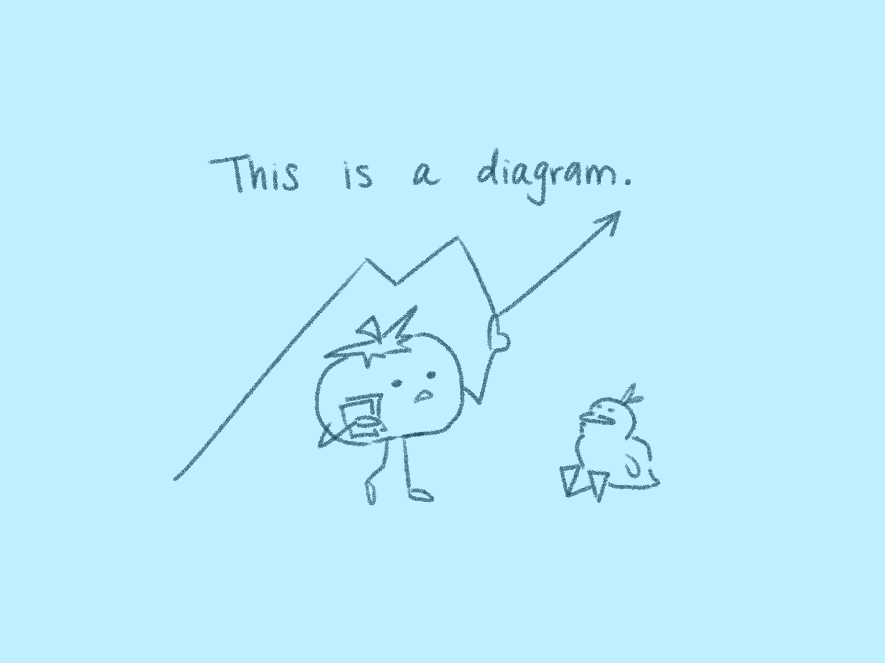

# Project Report

---

## Overview
This project investigates a challenging form of spatial reasoning under limited visual input, where depth and scale must be inferred rather than directly measured. By using FPS gameplay as a controlled yet dynamic testbed, the work contributes to understanding how computer vision systems perform in scenarios analogous to real-world applications such as surveillance and sports analytics, where only monocular video is available.

We ask of the follow questions:

* How accurately can player positions be approximated in a bird’s-eye-view representation using only monocular video input?
* How do simple geometric heuristics compare to learned monocular depth estimation models for BEV reconstruction in FPS environments?
* To what extent does temporal tracking improve the stability and accuracy of spatial estimates?

---

## Data collection
### Dataset sources
### Demo parsing
### Frame extraction
### Ground truth
### Data preprocessing

-   :material-magnify: **Detection**

    ---

    YOLO-based player detection on raw gameplay frames.

-   :material-motion-outline: **Tracking**

    ---

    Multi-object tracking across frames with ByteTrack.

-   :material-map-outline: **BEV Localization**

    ---

    Projects tracked players into a top-down map view.

## Methodology
### Overall pipeline
### Detection
### Tracking
### BEV localization
### Synchronization
### Evaluation metrics

## Results
### Quantitative metrics
### Visualizations
### Example outputs
### Comparisons

## Discussion
### Why certain methods performed better
### Failure cases
### Limitations
### Design decisions

### Detection

Why use YOLOv? fine-tuned on annotated gameplay frames to detect player
bounding boxes with high recall under motion blur and occlusion.

## Conclusion and Future Work
### What was achieved
### Research question revisited
### Better detectors
### Better tracking
### Learned BEV models
### Larger datasets
### Real-time inference