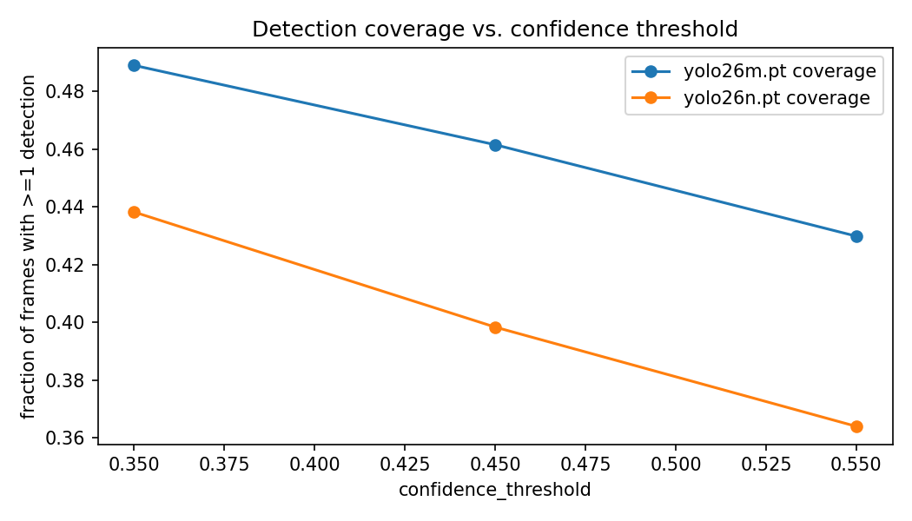
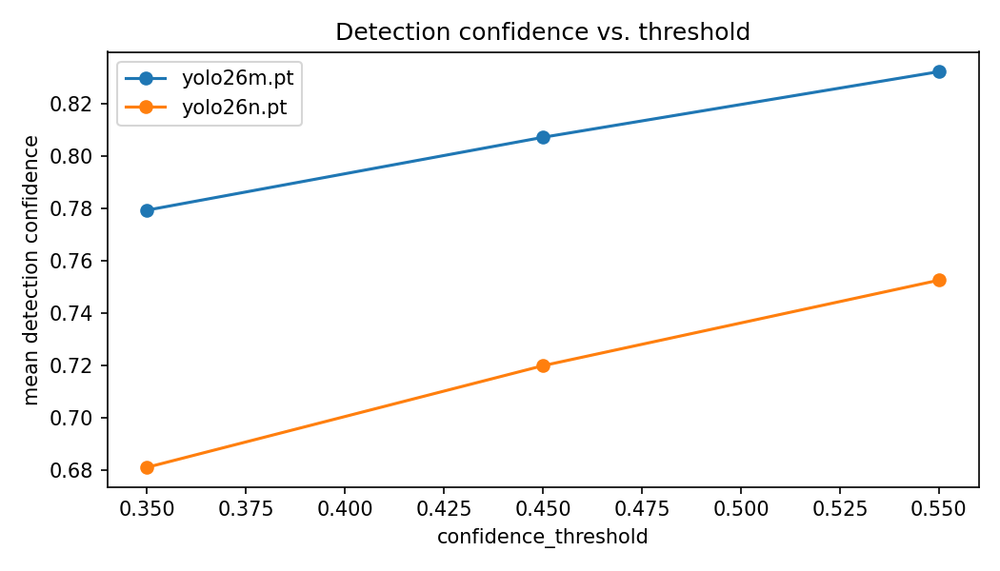
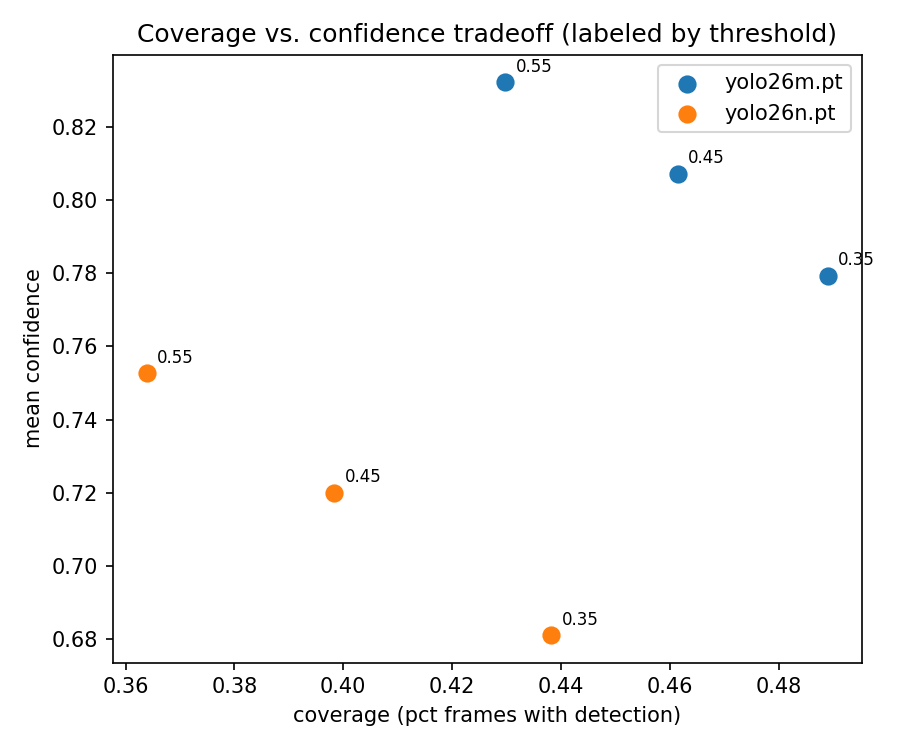
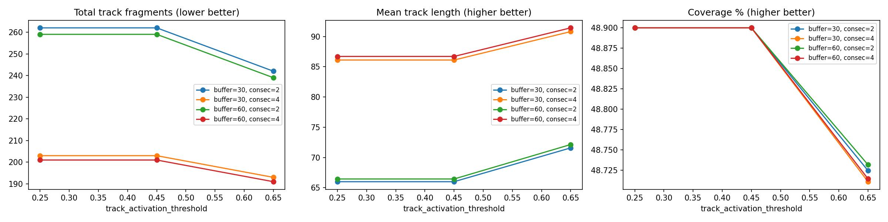
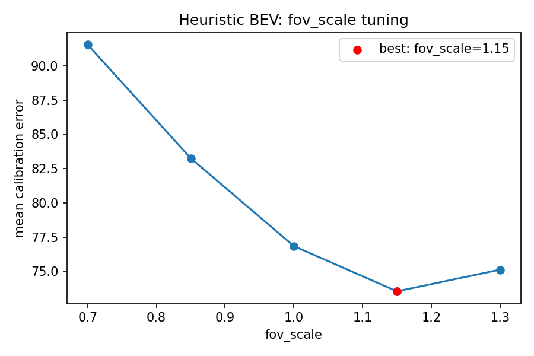
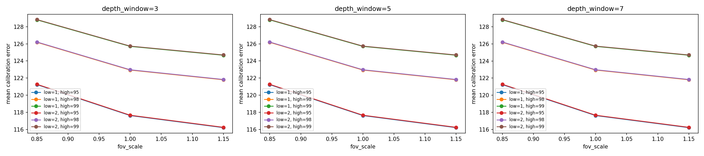
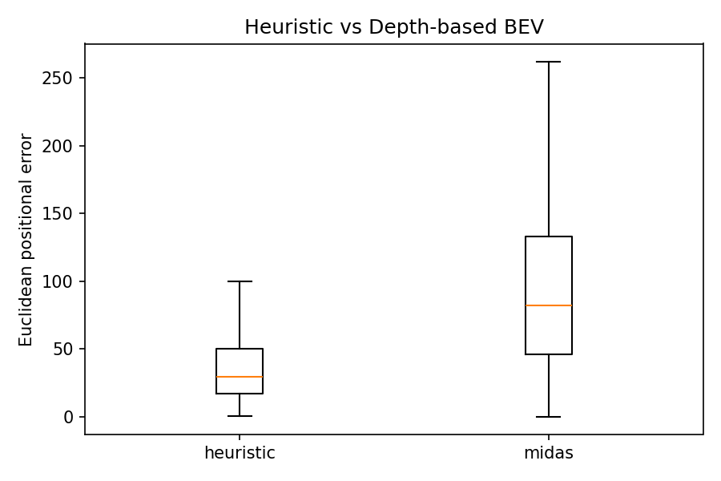
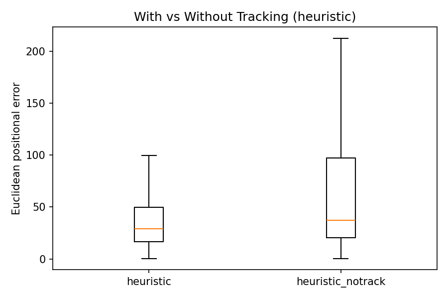

# Results

Three professional CS2 matches containing 64 recorded rounds were collected as the dataset. Due to hardware limitations, 9 rounds were randomly selected for the rest of the pipeline: 6 used as a training/calibration set and 3 as a validation set. Detection was performed using YOLO26m, tracking using ByteTrack, and BEV localization using both a geometric heuristic and a MiDaS-based depth approach.

## Detection
Player detection was performed using a YOLO26m model restricted to the **person** class, with predictions passed as input directly to the tracking stage.

A grid search was run over

    model_name ∈ { "yolo26n.pt", "yolo26m.pt" }
    confidence_threshold ∈ { 0.35, 0.45, 0.55 }
    
against the training set, scored using a coverage/confidence proxy metric (harmonic mean of the fraction of frames with at least one detection, and mean detection confidence), since no ground-truth-based recall/precision was available for this stage. No manual visual review of individual configurations was performed.

**Tuning summary**

| experiment | model | confidence_threshold | coverage | mean_confidence | quality_score |
|---|---|---:|---:|---:|---:|
| yolo26m_conf35 | yolo26m.pt | 0.35 | 0.489 | 0.779 | 0.651 |
| yolo26m_conf45 | yolo26m.pt | 0.45 | 0.462 | 0.807 | 0.646 |
| yolo26m_conf55 | yolo26m.pt | 0.55 | 0.430 | 0.832 | 0.634 |
| yolo26n_conf35 | yolo26n.pt | 0.35 | 0.438 | 0.681 | 0.575 |
| yolo26n_conf45 | yolo26n.pt | 0.45 | 0.398 | 0.720 | 0.567 |
| yolo26n_conf55 | yolo26n.pt | 0.55 | 0.364 | 0.753 | 0.555 |

`yolo26m` outperformed `yolo26n` at every confidence threshold tested, on both coverage and mean confidence. Within `yolo26m`, lower confidence thresholds increased coverage more than they reduced mean confidence, so `yolo26m_conf35` scored highest under the proxy metric.

**Chosen configuration:**

| Parameter | Value |
|---|---|
| `model_name` | `yolo26m.pt` |
| `confidence_threshold` | 0.35 |
| `crop_bottom_ratio` | 0.0 |
| `batch_size` | 8 |

**Final detection visualization**

<figure>
  <video controls width="100%">
    <source src="/monocular-bev-localization/assets/videos/detection_video.mp4" type="video/mp4">
  </video>
  <figcaption>
    <strong>Figure 1.</strong> Detection video.
  </figcaption>
</figure>

## Tracking
Multi-object tracking was performed using ByteTrack.

A grid search was run over

    track_activation_threshold ∈ { 0.25, 0.45, 0.65 }
    lost_track_buffer ∈ { 30, 60 }
    minimum_consecutive_frames ∈ { 2, 4 }

against the training set, scored using a composite proxy (mean of three min-max normalized signals: fewer total track fragments, longer mean track length, higher frame coverage). As with detection, no ground-truth-based tracking accuracy was available and no manual visual review was performed.

**Tuning summary**

| experiment | activation | lost_buffer | consecutive | fragments | mean_length | coverage % | combined_score |
|---|---:|---:|---:|---:|---:|---:|---:|
| activation0.25_lost_buffer60_consecutive4 | 0.25 | 60 | 4 | 201 | 86.70 | 48.900 | 0.891 |
| activation0.45_lost_buffer60_consecutive4 | 0.45 | 60 | 4 | 201 | 86.70 | 48.900 | 0.891 |
| activation0.25_lost_buffer30_consecutive4 | 0.25 | 30 | 4 | 203 | 86.11 | 48.900 | 0.874 |
| activation0.45_lost_buffer30_consecutive4 | 0.45 | 30 | 4 | 203 | 86.11 | 48.900 | 0.874 |
| activation0.65_lost_buffer60_consecutive4 | 0.65 | 60 | 4 | 191 | 91.43 | 48.714 | 0.673 |
| activation0.65_lost_buffer30_consecutive4 | 0.65 | 30 | 4 | 193 | 90.81 | 48.711 | 0.649 |
| activation0.25_lost_buffer60_consecutive2 | 0.25 | 60 | 2 | 259 | 66.44 | 48.900 | 0.353 |
| activation0.45_lost_buffer60_consecutive2 | 0.45 | 60 | 2 | 259 | 66.44 | 48.900 | 0.353 |
| activation0.25_lost_buffer30_consecutive2 | 0.25 | 30 | 2 | 262 | 65.99 | 48.900 | 0.333 |
| activation0.45_lost_buffer30_consecutive2 | 0.45 | 30 | 2 | 262 | 65.99 | 48.900 | 0.333 |
| activation0.65_lost_buffer60_consecutive2 | 0.65 | 60 | 2 | 239 | 72.14 | 48.732 | 0.225 |
| activation0.65_lost_buffer30_consecutive2 | 0.65 | 30 | 2 | 242 | 71.58 | 48.724 | 0.191 |

!!! tip ""
    

Three patterns are notable in this sweep:

- **`minimum_consecutive_frames` was the dominant lever.** Holding activation and buffer fixed, raising `consecutive` from 2 to 4 substantially reduced fragmentation and increased mean track length in every case (e.g. at `activation=0.25, lost_buffer=30`: 262 → 203 fragments, 66.0 → 86.1 mean length) — a larger effect than either of the other two parameters produced on their own.
- **`activation=0.25` and `activation=0.45` are identical in every row.** No detection in this dataset has confidence between 0.25 and 0.45 (consistent with the detection stage's confidence distribution above), so this pair of values did not actually probe distinct tracker behavior.
- **`activation=0.65` trades coverage for stability, rather than losing outright.** It achieves the lowest fragmentation and longest mean track length of any configuration tested, at a small cost in the fraction of frames with any track at all. It scores lower under the combined proxy only because that proxy weights all three signals equally; a use case prioritizing track stability over frame coverage could reasonably prefer this configuration instead.

**Chosen configuration:**

| Parameter | Value |
|---|---|
| `track_activation_threshold` | 0.25 |
| `lost_track_buffer` | 60 |
| `minimum_consecutive_frames` | 4 |

**Trajectory visualization**

Tracking visualization video is very similar to detection video. For clearer understanding of the tracking quality, the trajectory visualization is shown instead. For tracking videos, see [visualization gallery](#visualizations)

  <figure style="flex: 1; margin: 0;">
    <video controls width="100%">
      <source src="/monocular-bev-localization/assets/videos/heuristic_trajectory.mp4" type="video/mp4">
    </video>
    <figcaption>
      <strong>(a)</strong> Camera-relative heuristic trajectory.
    </figcaption>
  </figure>

  <figure style="flex: 1; margin: 0;">
    <video controls width="100%">
      <source src="/monocular-bev-localization/assets/videos/midas_trajectory.mp4" type="video/mp4">
    </video>
    <figcaption>
      <strong>(b)</strong> Camera-relative MiDaS trajectory.
    </figcaption>
  </figure>

## BEV Estimation
Both BEV methods were tuned against a **calibration set** containing frames where manual track-to-player labeling gives trusted identity for a direct comparison between a projected prediction and its true ground-truth position. Tuning parameters were evaluated by their effect on mean [Euclidean positional error](methodology.md#evaluation-metrics) on this calibration set.

### Heuristic
The heuristic depth estimation method estimates player distance using geometric assumptions.

A grid search was run over

    fov_scale ∈ {0.7, 0.85, 1.0, 1.15, 1.3}

against the calibration set, with `depth_window`, `low_pct`, and `high_pct` held at their defaults (not applicable to the heuristic depth signal).

**Tuning Summary**

| depth_window | low_pct | high_pct | fov_scale | mean_error |
|---:|---:|---:|---:|---:|
| 5 | 2 | 98 | 0.70 | 91.55 |
| 5 | 2 | 98 | 0.85 | 83.26 |
| 5 | 2 | 98 | 1.00 | 76.84 |
| 5 | 2 | 98 | **1.15** | **73.54** |
| 5 | 2 | 98 | 1.30 | 75.12 |

Error decreases smoothly as `fov_scale` increases from 0.7 toward 1.15, then rises again at 1.3. This well-defined minimum indicating the original ~90° field-of-view assumption was reasonably close to the camera's true FOV. Tuning reduced mean calibration error from 76.84 (default `fov_scale=1.0`) to 73.54.

**Chosen configuration:**

| Parameter | Value |
|---|---|
| `fov_scale` | 1.15 |
| `depth_window` | 5 (default) |
| `low_pct` | 2.0 (default) |
| `high_pct` | 98.0 (default) |

### MiDaS
The MiDaS depth extraction method was performed using MiDaS DPT_Hybrid.

A grid search was run over

    depth_window ∈ {3, 5, 7, 9}
    low_pct ∈ {1, 2, 5}
    high_pct ∈ {95, 98, 99}
    fov_scale ∈ {0.7, 0.85, 1.0, 1.15, 1.3}

against the calibration set.
 
**Tuning Summary**
 
*(full 45-row grid; see `outputs/tuning/bev/midas/tuning_summary.csv` for complete results)*

| depth_window | low_pct | high_pct | fov_scale | mean_error |
|---:|---:|---:|---:|---:|
| 5 | 2 | 98 | 1.00 *(default)* | 122.97 |
| 3 | 1 | 95 | 0.85 | 121.23 |
| 3 | 1 | 95 | 1.00 | 117.61 |
| **3** | **1** | **95** | **1.15** | **116.20** |
| 3 | 2 | 95 | 1.15 | 116.25 |

!!! tip ""
    

Two consistent patterns are visible across the full grid: lower `high_pct` (95 over 98 or 99) and higher `fov_scale` (1.15 over 0.85 or 1.0) both reduced error, while `depth_window` and `low_pct` had comparatively little effect within the ranges tested (the difference between `depth_window=3` and `depth_window=7` at matching other parameters was under 0.05 in every case). Tuning reduced mean calibration error from 122.97 (default configuration) to 116.20 — a real, if modest, improvement, in contrast to the near-zero effect observed in an earlier tuning pass (discussed further in [Discussion](discussion.md#result-interpretation)).

**Chosen configuration:**
 
| Parameter | Value |
|---|---|
| `depth_window` | 3 |
| `low_pct` | 1.0 |
| `high_pct` | 95.0 |
| `fov_scale` | 1.15 |

## Comparisons

### Heuristic vs. MiDaS
Final per-video evaluation results, using each method's tuned configuration above:

| Video | Heuristic scale | Heuristic mean Euclidean error | MiDaS scale | MiDaS mean Euclidean error |
|---|---:|---:|---:|---:|
| match_1_round_1 | 5.595 | 52.48 | 1.301 | 70.89 |
| match_1_round_2 | 4.275 | 53.19 | 1.167 | 83.07 |
| match_2_round_1 | 5.210 | 46.45 | 1.550 | 140.10 |
| match_2_round_2 | 5.477 | 25.69 | 1.145 | 62.81 |
| match_3_round_1 | 6.174 | 57.63 | 1.527 | 93.64 |
| match_3_round_2 | 5.454 | 42.78 | 1.648 | 128.15 |

**Overall summary (all videos pooled)**

| Metric | Heuristic | MiDaS | Heuristic advantage |
|---|---:|---:|---:|
| Mean Euclidean positional error | 46.92 | 99.44 | ~2.1x lower |
| Median Euclidean positional error | 29.29 | 82.35 | ~2.8x lower |
| Mean relative spatial error | 33.18 | 65.32 | ~2.0x lower |
| Mean trajectory step distance | 3.21 | 14.22 | ~4.4x lower |

The heuristic method outperformed MiDaS across **all three** evaluation metrics, consistently, across every individual video. `match_2_round_2` was the best-performing round for both methods; MiDaS's worst round was `match_2_round_1` (140.10), notably different from heuristic's worst (`match_3_round_1`, 57.63) — the two methods do not degrade on the same rounds. Full discussion and interpretation in [Discussion](discussion.md#result-interpretation).

<figure>
  <video controls width="100%">
    <source src="/monocular-bev-localization/assets/videos/comparison_video.mp4" type="video/mp4">
  </video>
  <figcaption>
    <strong>Figure 2.</strong> Comparison visualization (tracked video + heuristic BEV + MiDaS BEV)
  </figcaption>
</figure>

  <figure style="flex: 1; margin: 0;">
    <video controls width="100%">
      <source src="/monocular-bev-localization/assets/videos/heuristic_bev_vs_gt.mp4" type="video/mp4">
    </video>
    <figcaption>
      <strong>(a)</strong> Heuristic BEV estimation vs ground truth.
    </figcaption>
  </figure>

  <figure style="flex: 1; margin: 0;">
    <video controls width="100%">
      <source src="/monocular-bev-localization/assets/videos/midas_bev_vs_gt.mp4" type="video/mp4">
    </video>
    <figcaption>
      <strong>(b)</strong> MiDaS BEV estimation vs ground truth.
    </figcaption>
  </figure>

### Track vs. No Track
To isolate tracking's specific contribution to localization accuracy, a second BEV estimation was run using the heuristic method on **untracked** detections. As mentioned in [Data Collection](data_collection.md#ground-truth), a pseudo-tracking set was built by treating each frame's detections as independent (no persistent identity across frames). The pseudo-tracking set was matched to ground truth per-frame using Hungarian assignment rather than the manual track labels used elsewhere in evaluation. 

MiDaS was not evaluated in the no-tracking condition, since the heuristic-vs-MiDaS comparison above already established heuristic as the stronger BEV method, and the tracking ablation's purpose is to isolate tracking's effect rather than re-run every combination.

Trajectory consistency is not reported for the no-tracking condition, since it requires persistent identity across frames to measure, thus not applicable to the pseudo-tracking data. This is an expected limitation of the comparison, not a missing result.

!!! warning "Evaluation asymmetry"
    The no-tracking baseline does not apply the same POV-self / dead-body exclusion filtering used in the tracked evaluation, since that filtering relies on manually labeled persistent track IDs (not available for the pseudo-tracking set). The reported gap between tracked and untracked accuracy should therefore be read as an **upper bound** on tracking's benefit, not a perfectly isolated measurement.

| Metric | Heuristic (tracked) | Heuristic (no track) | Tracking's effect |
|---|---:|---:|---:|
| Mean Euclidean error | 46.92 | 71.91 | ~35% lower with tracking |
| Mean relative spatial error | 33.18 | 53.06 | ~37% lower with tracking |
| Mean trajectory step distance | 3.21 | N/A (no persistent identity) | — |

**Per-video breakdown:**

| Video | Heuristic (tracked) | Heuristic (no track) | Increase without tracking |
|---|---:|---:|---:|
| match_1_round_1 | 52.48 | 76.28 | +45% |
| match_1_round_2 | 53.19 | 67.38 | +27% |
| match_2_round_1 | 46.45 | 58.30 | +25% |
| match_2_round_2 | 25.69 | 102.99 | +301% |
| match_3_round_1 | 57.63 | 63.44 | +10% |
| match_3_round_2 | 42.78 | 61.35 | +43% |

Tracking meaningfully improved both positional accuracy metrics, although the true improvement attributable to tracking alone may be somewhat smaller than this gap suggests due to the asymmetry.

## Visualizations

  <video controls data-caption="Detection, match 1 round 1">
    <source src="/monocular-bev-localization/assets/visualization_gallery/detection/match_1_round_1.mp4" type="video/mp4">
  </video>
  <video controls data-caption="Tracking, match 1 round 1">
    <source src="/monocular-bev-localization/assets/visualization_gallery/tracking/match_1_round_1.mp4" type="video/mp4">
  </video>
  <video controls data-caption="Combined, match 1 round 1">
    <source src="/monocular-bev-localization/assets/visualization_gallery/combined/match_1_round_1.mp4" type="video/mp4">
  </video>
  <video controls data-caption="BEV vs GT (heuristic), match 1 round 1">
    <source src="/monocular-bev-localization/assets/visualization_gallery/bev_vs_gt/match_1_round_1_heuristic_bev_vs_gt.mp4" type="video/mp4">
  </video>
  <video controls data-caption="BEV vs GT (MiDaS), match 1 round 1">
    <source src="/monocular-bev-localization/assets/visualization_gallery/bev_vs_gt/match_1_round_1_midas_bev_vs_gt.mp4" type="video/mp4">
  </video>
  <video controls data-caption="Detection, match 3 round 1">
    <source src="/monocular-bev-localization/assets/visualization_gallery/detection/match_3_round_1.mp4" type="video/mp4">
  </video>
  <video controls data-caption="Tracking, match 3 round 1">
    <source src="/monocular-bev-localization/assets/visualization_gallery/tracking/match_3_round_1.mp4" type="video/mp4">
  </video>
  <video controls data-caption="Combined, match 3 round 1">
    <source src="/monocular-bev-localization/assets/visualization_gallery/combined/match_3_round_1.mp4" type="video/mp4">
  </video>
  <video controls data-caption="BEV vs GT (heuristic), match 3 round 1">
    <source src="/monocular-bev-localization/assets/visualization_gallery/bev_vs_gt/match_3_round_1_heuristic_bev_vs_gt.mp4" type="video/mp4">
  </video>
  <video controls data-caption="BEV vs GT (MiDaS), match 3 round 1">
    <source src="/monocular-bev-localization/assets/visualization_gallery/bev_vs_gt/match_3_round_1_midas_bev_vs_gt.mp4" type="video/mp4">
  </video>

